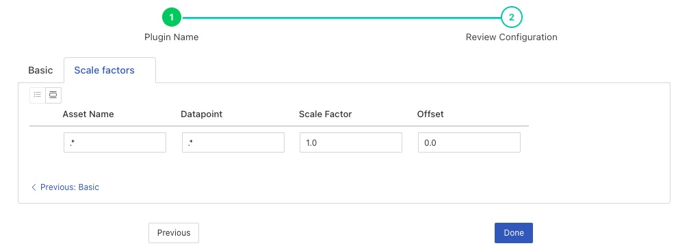

.. Images

.. Links
.. |scale| raw:: html

   <a href="../fledge-filter-scale/index.html">fledge-filter-scale</a>

Scale Set Filter
================

The *fledge-filter-scale-set* plugin is a filter that allows a scale factor and an offset to be applied to numerical data where an asset has multiple data points. It is very similar to the |scale| filter, which allows a single scale and offset to be applied to all assets and data points. It's primary uses are for adjusting values to match different measurement scales, for example converting temperatures from Centigrade to Fahrenheit or when a sensor reports a value in non-base units, e.g. 1/10th of a degree.

Scale set filters are added in the same way as any other filters.

  - Click on the Applications add icon for your service or task.

  - Select the *scale-set* plugin from the list of available plugins.

  - Name your scale-set filter.

  - Click *Next* and you will be presented with the following configuration page

    +--------------+
    | |scaleset_1| |
    +--------------+

  - This allows you to select if the filter should be enabled or disabled

  - Now click on the *Scale factors* tab

    +--------------+
    | |scaleset_2| |
    +--------------+

  - This allows the entry of a set of asset names, datapoint names, scale factors and offsets.

  - A list that defines a set of factors and offsets to apply particular assets and datapoints within these assets. A regular expression that is matched against the asset name and another that matches the data point name within the asset to determine if a particular scale factor and offset is applied to the datapoint value.

    .. list-table::
   :header-rows: 1

   * - Name
     - Description
   * - asset
     - A regular expression to match against the asset name. The scale factor is only applied to assets whose name matches this regular expression.
   * - datapoint
     - A regular expression to match against the data point name within a matching asset. The scale factor is only applied to assets whose name matches this regular expression.
   * - scale
     - The scale factor to apply to the numeric data.
   * - offset
     - The offset to add to the matching numeric data.

  - Click on *Done* to activate your plugin

List Interactions
~~~~~~~~~~~~~~~~~

There are a number of ways you can interact with the list of scale factors. A pair of buttons control the view that is seen of the list.

+------------------+
| |scaleset_views| |
+------------------+

   - Clicking on the left button will display a grid based view of the list of assets, datapoint, scale factor and offset.

   - Clicking on the right button will display a more detailed view for each entry in the list.

+--------------+
| |scaleset_3| |
+--------------+

In this more detailed view individual items may be collapsed or expanded. Entries may also be deleted from the list by clicking on the cross icon to the right of the entry.

In both views there are a set of controls that allow entries to be added to the list, imported and exported.

+---------------------+
| |scaleset_commands| |
+---------------------+

The import and export functions support two file formats; a CSV file format and a JSON format.

The CSV format has a single header row that list the 4 items that make up each entry in the list;

.. code-block:: console

    asset,datapoint,scale,offset
    .*,temperature,1.8,32
    .*,humidity,0.1,0

The names are the internal names used for the items in the list.

The JSON file format uses these same names as the keys in each of the list item objects

.. code-block:: JSON

    [
      {
        "asset": ".*",
        "datapoint": "temperature",
        "scale": "1.8",
        "offset": "32.0"
      },
      {
        "asset": ".*",
        "datapoint": "humidity",
        "scale": "0.1",
        "offset": "0.0"
      }
    ]

The import function allows for the imported data to either be appended to the current list or to overwrite the current list.

Example
-------

In the following example we have an asset whose name is *environment* which contains two data points; *temperature* and *humidity*. We wish to allow two different scale factors and offsets to these two data points whilst not affecting assets of any other name in the data stream. We can accomplish this by using the following list of scale factors in the plugin configuration;

.. list-table::
   :header-rows: 1

   * - asset
     - datapoint
     - scale
     - offset
   * - environment
     - temperature
     - 1.8
     - 32.0
   * - environment
     - humidity
     - 0.1
     - 0.0

If instead we had multiple assets that contain *temperature* and *humidity* we can accomplish the same transformation on all these assets, whilst not affecting any other datapoints, by changing the *asset* regular expression to something that matches more asset names;

.. list-table::
   :header-rows: 1

   * - asset
     - datapoint
     - scale
     - offset
   * - .*
     - temperature
     - 1.8
     - 32.0
   * - .*
     - humidity
     - 0.1
     - 0.0

List Interactions
~~~~~~~~~~~~~~~~~

Configuration items that require the user to enter lists of values, each of which has multiple items within a list entry, offer a number of features to allow the user to interact with them. This allows for;

   - Grid or detail views of the list contents.

   - Import and Export of the list contents in either CSV or JSON format.

   - Addition and deletion of individual list items.
